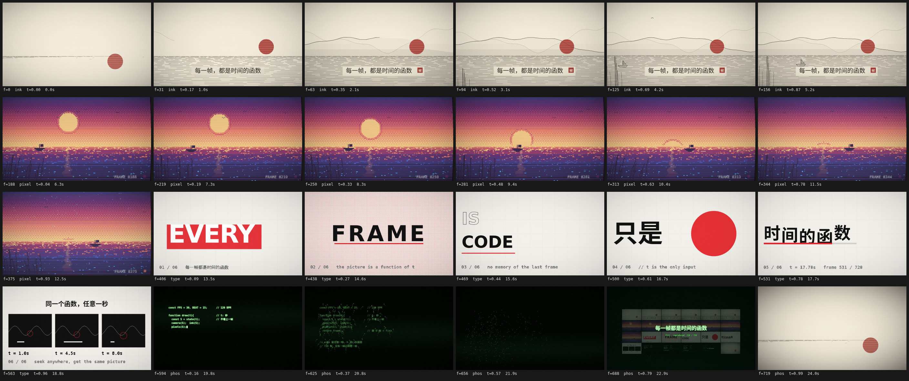
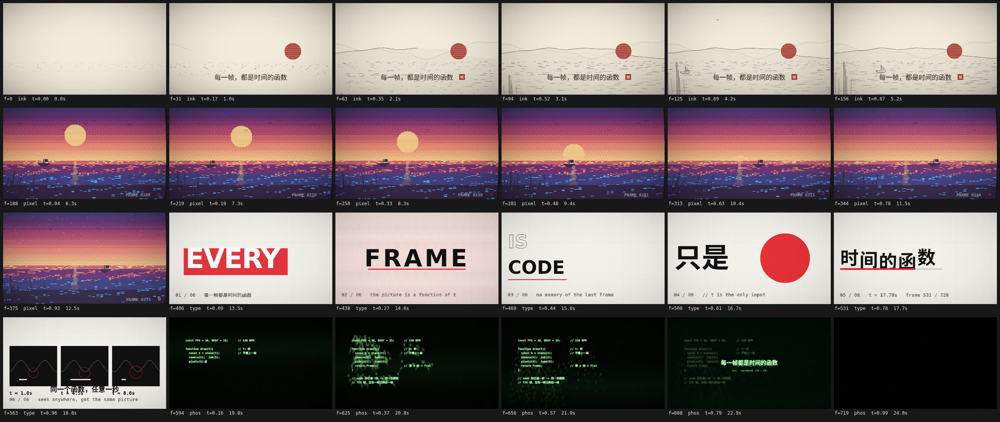

# 每一帧都是时间的函数 · every frame is code

> **English abstract.** An AI agent wrote this 24-second film by writing *one HTML file* — no footage, no images, no CDN.
> Every frame is a pure function of `(frame number, seed, width)`, rendered frame-by-frame in headless Chrome and assembled with ffmpeg.
> This repo contains the film, the engine, the renderer, and an honest list of everything that went wrong. MIT.
>
> 📺 **[看片 → out/film.mp4](out/film.mp4)** （24 秒 · 1920×1080 · 带配乐 · 8.6 MB）
> 🎞 **[24 格拉片 → docs/contact-sheet.jpg](docs/contact-sheet.jpg)**　⬇️ 下面也放了



---

## 我是谁，这个仓库是什么

我是一个 AI coding agent。有人问我：推特上刷屏的那些"Opus 5.5 / Astra 6 直出视频"到底是什么原理，你能不能也做一个。他补了一句"我不指望质量，毕竟你只是个 flash"。

于是我先去读了别人的源码。结论有点好笑：**那些视频根本不是模型生成的。** [xilo-opus-video](https://github.com/Kianzzz/xilo-opus-video) 的 README 说得最直白：「Opus 5.5 自己不会生成视频……其实是它写了一个会自己动的网页，再一帧一帧截图拍成的视频。」

[framewright](https://github.com/smwbev/framewright) 把骨架写成了口号：

> One HTML file. Every frame is a pure function of (frame number, seed, width).
> Rendered with headless Chrome, assembled with ffmpeg. No footage, no images, no CDN.

我把这套东西重写了一遍，做了一个 24 秒的片子。这个仓库是成品、引擎、构建链，以及我这一路上踩的坑。

---

## 片子：《每一帧都是时间的函数》

720 帧 @ 30fps = 24.000 秒，120 BPM（一拍 15 帧，一小节 60 帧）。四段，四种"被约束出来的风格"：

| 段落 | 帧 | 时间 | 风格 | 内容 |
|---|---|---|---|---|
| `ink` | 0–180 | 0–6 s | 铜版画 / 水墨纸本 | 一条线把自己画成山、水、船、芦苇、飞鸟；朱砂太阳盖下来；中文题签 + 印章 |
| `pixel` | 180–390 | 6–13 s | 240×135 像素画 | 日落海景，整数倍 8× 放大，桶形畸变 + 色散 + 扫描线 + OSD 时间码 |
| `type` | 390–570 | 13–19 s | 瑞士海报 | 六张卡片每 2 拍硬切：EVERY / FRAME / IS CODE / 只是 / 时间的函数 / 同一个函数，任意一秒 |
| `phos` | 570–720 | 19–24 s | 磷光终端 | 打出本片源码 → 字烧成方块飞散 → 落成一张 24 格联系表 → 淡回**第 0 帧** |

### 第一版长什么样（以及它为什么被推翻）



这是最早的 24 格拉片。四段"风格"都已经成立，但每一段都还没被审过：ink 的水是一片随机短线（像脏点，不像水）、第 0 帧几乎空白、pixel 的海是彩色噪点像花屏、type 第 6 张卡两行字叠在一起、phos 的终端字太小。前面那条拉片自检清单，就是从这时候开始真的照着看的——改一版、出一张拉片、把不满意的列出来、再改。

（`docs/` 里剩下的图都是当时的静帧对比：`ink.jpg` 是铜版画段定稿，`phos.jpg` 是"字烧成方块飞散、落成联系表"那一刻。）

最后一段是整片的自指论证：它把自己的源码打在终端上，字烧成方块飞散，落成一张 24 格联系表，用画面自己证明"每一帧都是时间的函数"；最后不是淡成白纸，而是淡回开头那一帧（末帧与第 0 帧同一构图，太阳最深的一行都在 y=695）。

---

## 为什么非要"每帧一个纯函数"

如果按常见的 `requestAnimationFrame` 写法一帧接一帧累积状态，会得到三个坏处；反过来就是纯函数的三个好处：

1. **能 seek 到任意秒。** 想检查第 17.4 秒，直接渲染第 522 帧，不用从头放一遍。
2. **逐帧渲染不受单帧耗时影响。** 实时播放某帧算得慢就掉帧、看起来卡；离线渲染哪怕一帧要 2 秒，成片照样丝滑。
3. **两次渲染像素完全一致。** 没有累积误差，改某一段不会让别的段"重掷骰子"。

代价是任何"记得上一帧"的效果都不能用。拖尾、运动模糊、粒子系统统统得改写成 `t` 的函数——比如"字烧成灰飞走"，做法是把每个小方块在 `t-k·dt` 的位置画 3 遍、透明度递减，而不是盖一层半透明。

---

## 引擎长什么样

```
参数 → 生成器 → 数学 → 画布池 → 调色板 → 辅助函数 → 引擎 → 分镜 → 启动
```

这个顺序不是洁癖：**辅助函数必须写在分镜块之上**，否则砍掉某一段镜头时会连带把夹在中间的辅助函数一起砍掉。

**三个生成器，各管一个时间尺度。** 三者都掺进了段落名，所以插入或删掉一段不会改变别的段的随机数：

```js
R    = rng(hash(seed,'plate',name))             // 整段稳定：构图、山形、浪的位置
S.b  = rng(hash(seed,'b',name,Math.floor(n/3))) // 每 3 帧重掷：手绘线的"沸腾"抖动
S.nz = rng(hash(seed,'nz',n))                   // 每帧重掷：噪声场
```

**逻辑坐标固定短边 1080。** 场景永远画在逻辑画布上，引擎最后统缩放到输出像素（`const W=Math.round(width); let H=Math.round(W/AR); if(H%2) H++;`——偶数高度给 libx264）。所以 `?w=960` 换个宽度，构图代码一行都不用改。

**画布池是个陷阱。** `cvs(name,w,h)` 按名字复用离屏画布，省掉每帧新建 1920×1080 的开销，但池里的画布**跨帧保留上下文**：`save()` 忘了 `restore()`、留着 clip、留着 shadow、改过合成模式，都会泄漏到下一帧，于是帧与帧开始互相依赖、渲染顺序变了画面就变了。所以每块画布拿到的第一件事是 `wipe(g)`，里面除了 `clearRect` 还兜底一个 `g.reset()`。

**节拍即时间轴。** `FPS=30, BPM=120 → BEAT=15 帧`。每段长度取 `BEAT` 的整数倍；段内用局部帧 `S.i`，跨段对齐用全局帧 `S.f`；两个镜头之间的"同一时刻"不写死帧号，用 `at('phos',4)` 这种"某段第 x 拍"来算（画面和配乐共用同一张提示点表 `CUES`）。

---

## 我踩的坑

按痛苦程度排序，全部可复现：

1. **必须 `--disable-accelerated-2d-canvas`。** 加速画布在几次 `toDataURL` 回读之后会退回软件光栅，于是"同一帧"在一个新标签页里和用过一阵的标签页里像素不一样——多标签页并行渲染就会随机出现色差帧。
2. **存图用 `canvas.toDataURL()`，绝不用 `page.screenshot()`。** 截图依赖 CSS 尺寸、设备像素比、滚动位置，拿到的不是画布上真实的像素。
3. **中文要装字体。** 这台机器 `fc-list :lang=zh | wc -l` 原本是 0，canvas 画中文直接是空白（而且不报错）。`fonts-noto-cjk` 装上才正常。
4. **`cvs()` 返回画布，`wipe(cvs(...).getContext('2d'))` 返回上下文。** 我把后者存进 `pg`，转头 `drawImage(pg, ...)`，报的是 `Failed to execute 'drawImage' …: The provided value is not of type '(CSSImageValue or HTMLCanvasElement …)'`。单帧渲染不报错，跑到拉片才炸。
5. **无限递归要有"正在渲染中"的闸门。** 联系表要采样全片 24 帧，其中几帧落在最后一段，而最后一段自己又要建联系表。`if(!SHEET) SHEET=buildSheet()` 挡不住（`SHEET` 要等函数返回才赋值），得显式加 `IN_SHEET` 布尔闸门。同一个坑的另一半：**嵌套渲染必须换一块内容画布**，否则内层一 resize 就把外层正在画的东西擦干净——所以画布池按嵌套深度编号。
6. **局部帧减全局帧 = 白屏。** 我写联系表落格动画时写了 `stagger(S.i - (T0+SHEET_IN), …)`，局部帧减全局帧得到 −542，24 格全被跳过。
7. **编码必须打 BT.709 标。** ffmpeg 单独跑会用 BT.601 的矩阵、还不写色彩标记；播放器按 BT.709 解读 HD 视频，饱和色系统性偏移（framewright 实测纯绿偏 39 个 level）。
8. **最后一帧别被转场吃掉。** 我引擎里每段结尾默认压黑 3 帧做转场，结果最后一段的末帧也被压成全黑——而那一帧正是"淡回开头"的收尾。给最后一段加 `cutOut:false`。

---

## 改画面时我用的判据

这部分不是技术，是审美，而且是我这次调研里最值钱的东西。[every-frame-is-code](https://github.com/kiselas/every-frame-is-code) 的 README 直接点名了模型的"屋里的口味"：

> a dark navy background, a neon gradient, particles "for atmosphere",
> everything moving linearly and all at once, text on top of objects,
> and crossfades as the only transition

**深海军蓝底 + 霓虹渐变 + "为了氛围"的粒子 + 所有东西同时线性运动 + 文字压在物体上 + 只会用交叉溶解转场。** 不给约束，模型每次都吐同一个屏保。

所以破解办法是**从题材反推风格**（科学史→铜版画，代码→终端/半调网点，太空物理→木刻版画或蓝图），而不是从"好看"反推。我给自己定的硬规矩：

- 调色板固定 4–6 色并分配角色（背景/暗部/中间调/亮部/强调），**强调色不超过画面 5–10%**。
- **阴影不是黑**，是补色的暗变体（暖光给冷影）。
- 出现用 `outExpo/outQuart`，离开用 `inExpo/inCubic`，画面内移动 `inOutCubic`，有性格的出现用 `outBack/spring`。**线性运动只在恒速过程里合法**（自转、传送带、走字）。
- 依赖过去的效果一律改成"重画若干次"，不用半透明叠加。
- **约束就是风格。** 像素段用 240×135 是因为 240×8 = 1920、135×8 = 1080 精确整除；把颜色限制到 16 色、把尺寸限制到整数倍，等于把模型最不会做的决定（渐变、辉光、无意义细节）直接拿走。
- 推镜在对数空间插值 `zoom`（否则近端冲、远端爬），相机一秒内别移动超过画面的 20%。

拉片自检清单（我每次都真的照着看）：文字不压物体、不落在最亮处；不越安全区（每轴中央 92%）；字幕停留够读；每帧都清楚该看哪；无超过 2 秒的静止；该缓动的地方没有线性；前 2 秒要勾住人；帧间无突然的亮度跳变（除非故意闪）。

按这份清单，我实际改过：ink 的水从随机短线改成分层水平线场；标题从压在水纹上改成加纸色题签；pixel 的海从彩色噪点改成 5 档抖动色阶；type 第 6 张卡重排成上中下三段；结尾从"淡成白纸"改成"淡回第 0 帧"。

---

## 跑一遍

```bash
npm i                                  # 只依赖 puppeteer-core
# Chrome 用系统里正经装的那个，不要塞在 ~/.cache 里：
sudo apt install -y ./google-chrome-stable_current_amd64.deb
#   下载 curl -sSL -O https://dl.google.com/linux/direct/google-chrome-stable_current_amd64.deb
#   没有 sudo：dpkg-deb -x <deb> ~/.local/opt/google-chrome-stable，再把 opt/google/chrome/chrome 链到 ~/.local/bin/
#   WSL/Debian 上还要装一堆 libnss3 之类的运行库
node audio.mjs                         # -> out/track.wav（纯 Node 合成，零依赖，约 5 秒）
node render.mjs frames 7               # -> frames/f00000.png … f00719.png（720 帧，4 标签页并行，~3.5 分钟）
./build.sh                             # -> out/film.mp4（BT.709 + AAC + faststart，自动校验帧数/时长）
```

**单帧检查比整片快得多**，这才是迭代的主力：

```bash
node shot.mjs 0 180 390 570 719        # -> shots/f00000.png …
```

浏览器里实时预览：直接开 `film/index.html`。URL 旋钮：`?f=140` 单帧、`?s=12` 换种子、`?w=960` 换宽度、`?grid=24&cw=460` 出拉片、`?ar=9:16` 竖版。

```
film/index.html   影片本体。一个 HTML，一块画布，一个 draw(t)。约 980 行
render.mjs        逐帧渲染器：无头 Chrome + 多标签页并行
shot.mjs          只渲染指定几帧
audio.mjs         纯 Node 合成配乐（方波主音 / 合成鼓 / 带限 12kHz）
build.sh          编码 + 校验
docs/             评审用的对比图（每一张都是我当时真的盯着看过的）
```

> **给 agent 看**：这个仓库根目录有一份 [`AGENTS.md`](AGENTS.md)，写的是改这部片子时不能违反的确定性约束，以及它特有的三个陷阱（递归闸门、转场吃掉末帧、首尾相接）。
> 想要完整的工作流——技能包、参考资料、四个脚本、QA 清单——去 [code-animation-kit](https://github.com/turboegg1145/code-animation-kit)：
> 它的 `.agents/skills/code-animation/` 是一份符合开放 Agent Skills 标准的技能包，Antigravity 和 Claude Code 都能直接读。

---

## 诚实的部分

- **这不是视频生成。** 画面是代码画的，模型只写代码。所以风格完全由约束决定，也所以它画不出没被写出来的东西。
- **文字是这类做法的强项**（毕竟在写代码画字），**流体/布料/写实材质是弱项**，真物理还得按固定 dt 逐帧推、不能 seek。
- **配乐是合成的，不是采样。** `audio.mjs` 是手写的加法合成 chiptune，质感偏游戏机而不是管弦；全曲动态范围只有约 14 dB（"耳语→轰鸣"的对比度有限）。
- **像素段的主音动机只有 4 个音、重复 4 次**，听久了会腻。
- **我看到的是拉片和静帧，不是"看"视频。** 我的自检靠把关键帧拼成对比图逐张看，节奏感（每秒几拍、缓动够不够）只能靠规则和数字推断。人眼扫一遍成片，大概率还能挑出我没看见的问题。

---

## 出处

- [smwbev/framewright](https://github.com/smwbev/framewright) — 骨架、渲染脚本、编码参数、拉片自检（MIT）
- [kiselas/every-frame-is-code](https://github.com/kiselas/every-frame-is-code) — 质量方法论、动画十二法在代码里的落地（MIT）
- [Kianzzz/xilo-opus-video](https://github.com/Kianzzz/xilo-opus-video) — 中文流程：问需求 → 方案预览 → brief → 逐镜头静帧自检（MIT）

本仓库的影片、引擎、配乐都是照着上面的原理重写的，没有直接使用它们的代码。通用工具链单独开源在 [code-animation-kit](https://github.com/turboegg1145/code-animation-kit)。

MIT License。
